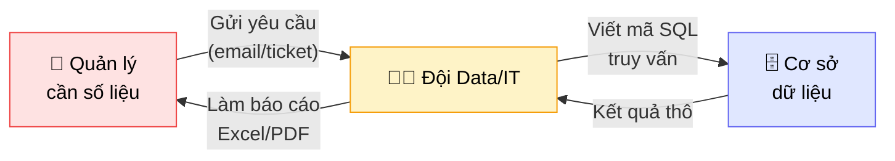
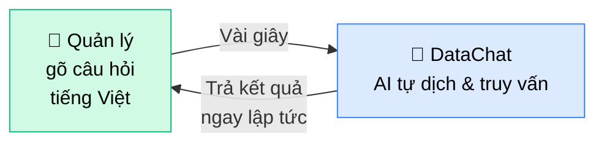
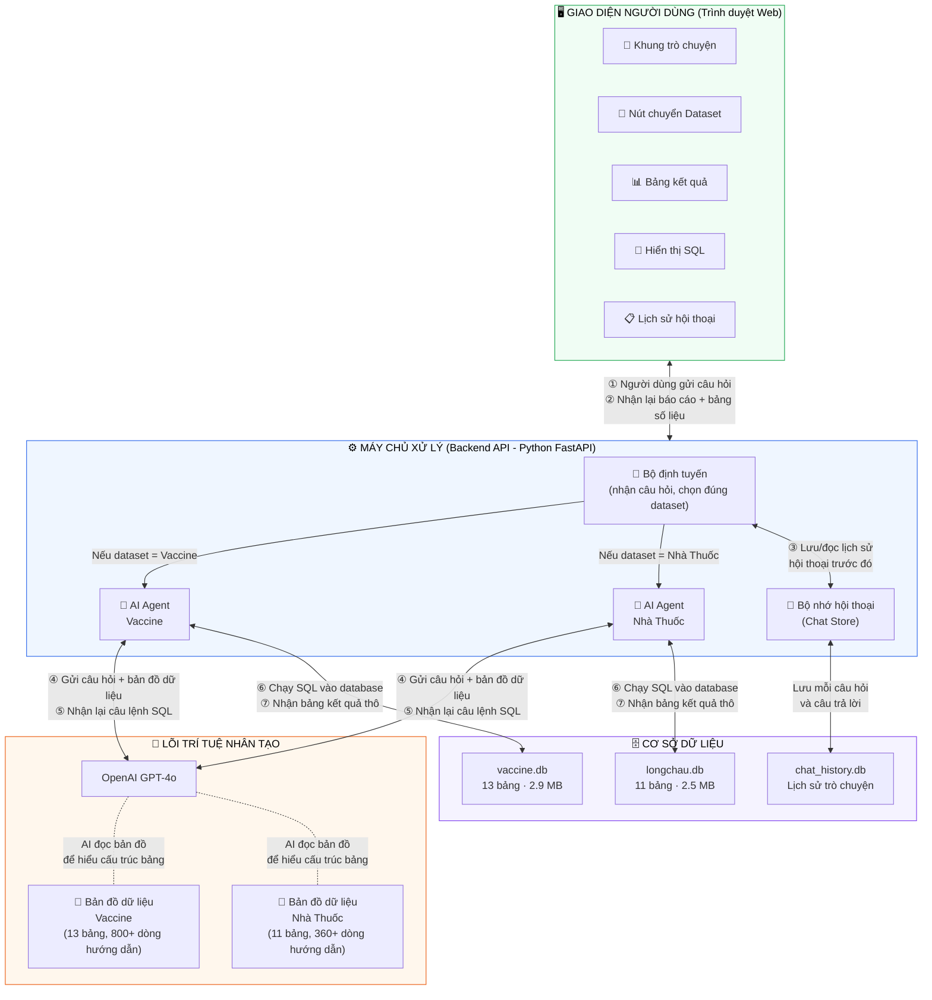
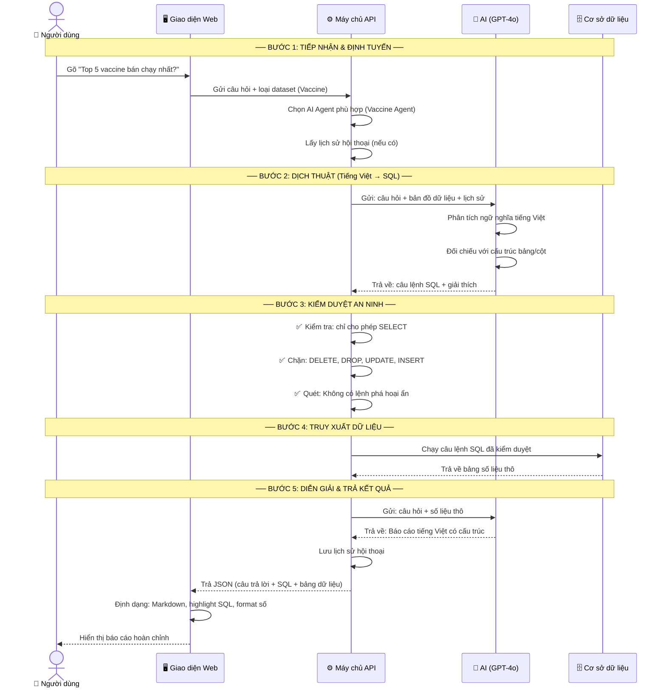
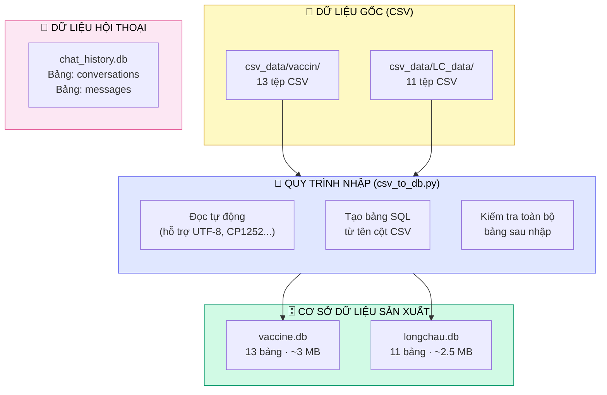
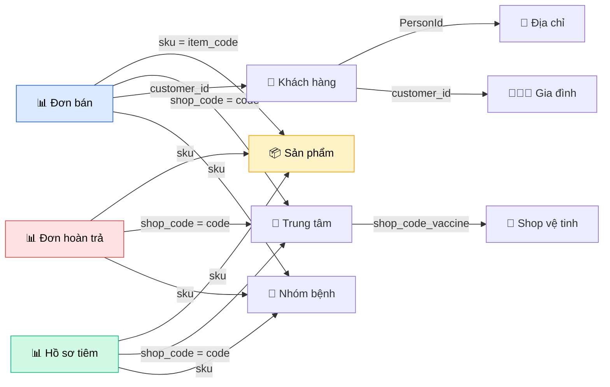
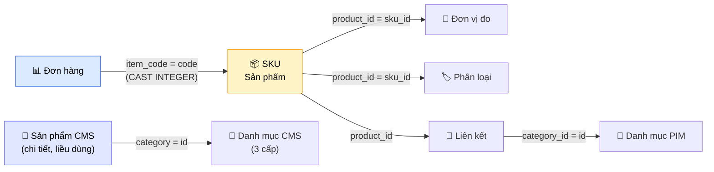
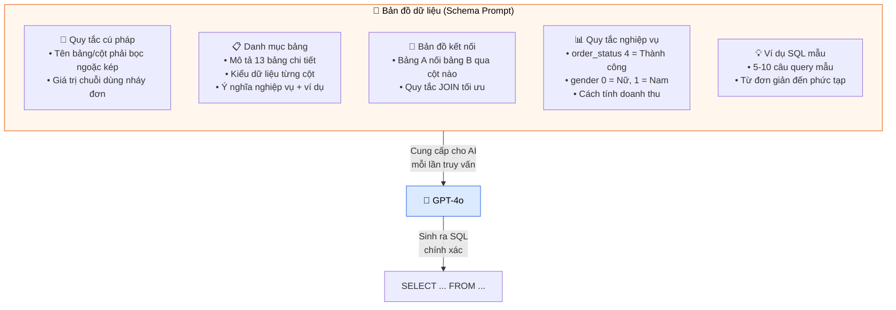
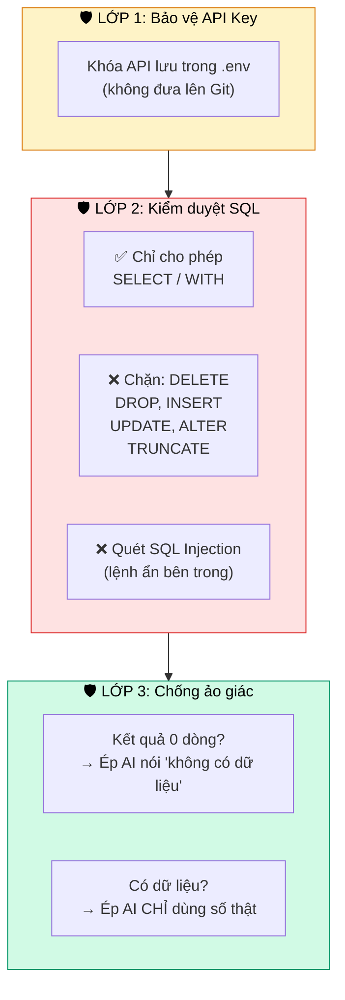
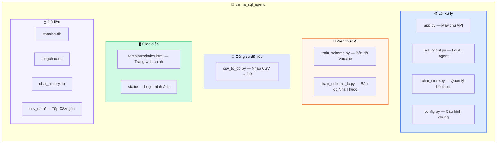

# BÁO CÁO TỔNG QUAN HỆ THỐNG TRỢ LÝ TRÍ TUỆ NHÂN TẠO DATACHAT

**Dự án:** Trợ lý ảo truy vấn dữ liệu bằng ngôn ngữ tự nhiên (DataChat) cho Hệ thống FPT Long Châu.
**Phiên bản:** 3.0 — Hỗ trợ đa bộ dữ liệu (Multi-Dataset).
**Đối tượng tài liệu:** Ban Lãnh đạo, Cấp quản lý (Tài liệu phi kỹ thuật).

    

---

## 1. MỤC TIÊU VÀ TẦM NHÌN

### 1.1 Bài toán cần giải quyết

Trong hoạt động hàng ngày, các bộ phận nghiệp vụ (quản lý cửa hàng, quản lý vùng, ban điều hành) thường xuyên cần truy xuất số liệu từ kho dữ liệu để ra quyết định. Quy trình truyền thống đòi hỏi:



**Vấn đề:** Quy trình này mất từ **vài giờ đến vài ngày** cho mỗi yêu cầu, tạo áp lực lớn cho đội ngũ Data/IT và làm chậm tốc độ ra quyết định.

### 1.2 Giải pháp DataChat

DataChat thay thế toàn bộ quy trình trên bằng **một cuộc trò chuyện trực tiếp**:



> [!IMPORTANT]
> **Kết quả:** Thời gian từ "cần số" đến "có số" giảm từ **hàng giờ/ngày** xuống còn **dưới 10 giây**.

### 1.3 Khả năng cốt lõi

| Khả năng | Mô tả | Ví dụ |
|----------|--------|-------|
| **Truy vấn tức thì** | Biến câu hỏi tiếng Việt thành báo cáo số liệu | *"Top 5 vaccine bán chạy nhất?"* |
| **Hiểu ngữ cảnh** | Trả lời câu hỏi nối tiếp dựa trên lịch sử | *"Giải thích cách tính kết quả trên"* |
| **Đa bộ dữ liệu** | Chuyển đổi nhanh giữa các phân hệ kinh doanh | Vaccine ↔ Nhà thuốc |
| **Chống bịa số** | Từ chối trả lời khi không có dữ liệu, thay vì đoán | Cơ chế Anti-Hallucination |

---

## 2. KIẾN TRÚC TỔNG THỂ HỆ THỐNG

Hệ thống DataChat gồm **4 thành phần chính** phối hợp với nhau:



**Giải thích các đường nối (theo số thứ tự):**

| Đường | Từ → Đến | Dữ liệu truyền tải |
|-------|----------|---------------------|
| **①** | Giao diện → Máy chủ | Câu hỏi tiếng Việt + loại dataset đang chọn (Vaccine/Nhà Thuốc) |
| **②** | Máy chủ → Giao diện | Bài phân tích AI + câu lệnh SQL + bảng số liệu (JSON) |
| **③** | Bộ định tuyến ↔ Chat Store | Đọc 20 cặp hỏi-đáp gần nhất (ngữ cảnh) + Lưu tin nhắn mới |
| **④** | AI Agent → GPT-4o | Câu hỏi + Bản đồ dữ liệu (~800 dòng) + Lịch sử hội thoại |
| **⑤** | GPT-4o → AI Agent | Câu lệnh SQL được AI viết ra + Giải thích ngắn |
| **⑥** | AI Agent → Database | Câu lệnh SQL (đã qua kiểm duyệt an ninh) |
| **⑦** | Database → AI Agent | Bảng kết quả thô (danh sách các dòng + tên cột) |

| # | Thành phần | Vai trò | Công nghệ |
|---|-----------|---------|-----------|
| 1 | **Giao diện Web** | Nơi người dùng gõ câu hỏi, xem kết quả, chuyển dataset | HTML/CSS/JavaScript |
| 2 | **Máy chủ API** | Tiếp nhận yêu cầu, điều phối xử lý, quản lý phiên | Python FastAPI |
| 3 | **Lõi AI** | "Bộ não" dịch tiếng Việt → SQL và giải thích kết quả | OpenAI GPT-4o |
| 4 | **Cơ sở dữ liệu** | Lưu trữ dữ liệu thật và lịch sử hội thoại | SQLite |

---

## 3. LUỒNG XỬ LÝ CHI TIẾT (Hành trình một câu hỏi)

Khi người dùng gõ một câu hỏi như *"Top 5 vaccine bán chạy nhất?"* và nhấn Gửi, hệ thống thực hiện **5 bước tuần tự** trong vòng 5-10 giây:



### Chi tiết từng bước:

#### Bước 1 — Tiếp nhận & Định tuyến
Khi người dùng gõ câu hỏi, hệ thống kiểm tra họ đang ở chế độ xem nào (Vaccine hay Nhà Thuốc) để gọi đúng bộ AI Agent chuyên biệt. Đồng thời, hệ thống lấy **20 cặp hỏi-đáp gần nhất** từ lịch sử để AI có ngữ cảnh khi xử lý câu hỏi tiếp theo.

#### Bước 2 — Dịch thuật (Text-to-SQL)
Đây là bước cốt lõi. AI nhận được:
- **Câu hỏi** tiếng Việt gốc của người dùng
- **Bản đồ dữ liệu** (~800 dòng) mô tả chi tiết: tên bảng, tên cột, kiểu dữ liệu, ý nghĩa nghiệp vụ, cách liên kết giữa các bảng, ví dụ mẫu
- **Lịch sử hội thoại** (nếu là câu hỏi nối tiếp)

Từ đó, AI "viết" ra một câu lệnh truy vấn SQL phù hợp.

#### Bước 3 — Kiểm duyệt An ninh
Trước khi chạy SQL vào dữ liệu thật, hệ thống **bắt buộc kiểm tra an ninh**:
- ✅ Chỉ cho phép lệnh **đọc dữ liệu** (`SELECT`, `WITH`)
- ❌ Chặn hoàn toàn các lệnh chỉnh sửa/xóa (`DELETE`, `DROP`, `UPDATE`, `INSERT`, `ALTER`, `TRUNCATE`)
- ❌ Quét phát hiện lệnh nguy hiểm ẩn bên trong câu truy vấn (SQL Injection)

> [!CAUTION]
> Cơ chế an ninh này đảm bảo **không thể** sử dụng chatbot để xóa hoặc sửa dữ liệu, kể cả do lỗi AI.

#### Bước 4 — Truy xuất dữ liệu
Câu lệnh SQL an toàn được thực thi trực tiếp vào cơ sở dữ liệu. Kết quả trả về dạng bảng số liệu thô (ví dụ: tên vaccine, số lượng bán).

#### Bước 5 — Diễn giải & Trả kết quả
AI nhận bảng số liệu thô và câu hỏi ban đầu, sau đó viết một **bài phân tích hoàn chỉnh bằng tiếng Việt** kèm nhận xét, so sánh và điểm quan trọng. Kết quả hiển thị trên giao diện gồm 3 phần:
1. **Bài phân tích** — Văn bản có cấu trúc (Markdown)
2. **Câu lệnh SQL** — Hiển thị có tô màu (syntax highlighting) để đội kỹ thuật xác minh
3. **Bảng số liệu** — Dữ liệu gốc có định dạng số dễ đọc

---

## 4. QUẢN LÝ DỮ LIỆU

### 4.1 Tổng quan 3 tầng dữ liệu



### 4.2 Dữ liệu Vaccine (13 bảng)

| Loại | Bảng | Nội dung | Số dòng mẫu |
|------|------|----------|-------------|
| 📊 Giao dịch | `vaccine_sales_order_detail` | Chi tiết đơn bán hàng tiêm chủng | 500 |
| 📊 Giao dịch | `vaccine_returned_order_detail` | Chi tiết đơn hoàn trả | 500 |
| 📊 Giao dịch | `vaccine_record` | Hồ sơ tiêm chủng (ai tiêm gì, ở đâu, khi nào) | 500 |
| 📁 Danh mục | `dim_product` | Danh sách sản phẩm vaccine (170 loại) | 170 |
| 📁 Danh mục | `dim_shop` | Thông tin trung tâm tiêm chủng | 500 |
| 📁 Danh mục | `dim_person` | Thông tin khách hàng (đã mã hóa PII) | 500 |
| 📁 Danh mục | `dim_person_address` | Địa chỉ khách hàng | 100 |
| 📁 Danh mục | `dim_family_member` | Thông tin thành viên gia đình | 500 |
| 📁 Danh mục | `dim_vaccine_disease_group` | Nhóm bệnh (60 nhóm) | 60 |
| 📁 Danh mục | `dim_vaccine_regimen` | Phác đồ tiêm chủng | 500 |
| 📁 Danh mục | `dim_statellite_shop` | Shop vệ tinh (liên kết Vaccine ↔ Nhà thuốc) | 500 |
| 📖 Tham khảo | `Docs` | Tài liệu mô tả dữ liệu | 391 |
| 📖 Tham khảo | `sample_tables` | Danh sách ý nghĩa các bảng | 11 |

### 4.3 Dữ liệu Nhà Thuốc Long Châu (11 bảng)

| Loại | Bảng | Nội dung | Số dòng mẫu |
|------|------|----------|-------------|
| 📊 Giao dịch | `fact_order_detail_oms_flc` | Chi tiết đơn hàng nhà thuốc | 500 |
| 📁 Sản phẩm | `dim_product_sku_pim_flc` | Thông tin SKU sản phẩm (mã, tên, ngành hàng) | 500 |
| 📁 Sản phẩm | `dim_products_cms_flc` | Chi tiết sản phẩm CMS (thành phần, liều dùng) | 500 |
| 📁 Sản phẩm | `dim_product_measures_pim_flc` | Đơn vị đo lường (Hộp, Viên, Gói...) | 500 |
| 📁 Sản phẩm | `dim_product_taxonomies_pim_flc` | Phân loại bệnh/nhóm sản phẩm | 500 |
| 📁 Sản phẩm | `dim_product_attributes_pim_flc` | Thuộc tính sản phẩm PIM | 500 |
| 📁 Sản phẩm | `dim_product_attributes_cms_flc` | Thuộc tính sản phẩm CMS | 500 |
| 📁 Danh mục | `dim_categories_cms_flc` | Danh mục sản phẩm CMS (3 cấp) | 500 |
| 📁 Danh mục | `dim_category_pim_flc` | Danh mục sản phẩm PIM | 500 |
| 📁 Liên kết | `dim_product_category_pim_flc` | Bảng nối sản phẩm ↔ danh mục | 500 |
| 📁 Tham khảo | `dim_attribute_types_cms_flc` | Loại thuộc tính (15 loại) | 15 |

### 4.4 Sơ đồ liên kết dữ liệu

Dưới đây là cách các bảng kết nối với nhau. AI được "dạy" sơ đồ này để biết cần nối bảng nào khi trả lời câu hỏi phức tạp:

**Vaccine:**


**Nhà thuốc:**


### 4.5 Lịch sử Hội thoại

Hệ thống lưu trữ **toàn bộ lịch sử trò chuyện** trong một cơ sở dữ liệu riêng (`chat_history.db`) gồm:
- **Bảng `conversations`:** Danh sách các cuộc hội thoại (ID, tiêu đề, thời gian tạo)
- **Bảng `messages`:** Từng tin nhắn (vai trò user/assistant, nội dung, SQL đã dùng, dữ liệu trả về)

Mục đích:
- Người dùng tải lại trang vẫn xem được lịch sử cũ
- AI đọc lịch sử để hiểu ngữ cảnh câu hỏi tiếp theo
- Lưu tối đa 20 cặp hỏi-đáp gần nhất làm bộ nhớ cho AI

---

## 5. "BẢN ĐỒ DỮ LIỆU" — CÁCH DẠY AI HIỂU NGHIỆP VỤ

### 5.1 Vấn đề

AI nói chung (như ChatGPT) không biết gì về cấu trúc dữ liệu nội bộ của Long Châu. Nó không biết bảng nào chứa doanh thu, cột nào là tên vaccine, hay `order_status = 4` nghĩa là gì.

### 5.2 Giải pháp: Schema Prompt

Đội phát triển đã soạn **tài liệu hướng dẫn chi tiết** (gọi là Schema Prompt) bằng chính tiếng Việt, dạy cho AI từng khái niệm nghiệp vụ:



| Dataset | Số bảng | Độ dài hướng dẫn | Ví dụ SQL mẫu |
|---------|---------|-------------------|----------------|
| Vaccine | 13 | ~800 dòng | 10 ví dụ (từ cơ bản → nâng cao) |
| Nhà Thuốc | 11 | ~365 dòng | 5 ví dụ |

---

## 6. CƠ CHẾ BẢO VỆ VÀ AN TOÀN

### 6.1 Kiến trúc bảo mật 3 lớp



### 6.2 Cơ chế Chống Ảo giác (Anti-Hallucination)

> [!WARNING]
> **Vấn đề phổ biến của AI:** Khi không tìm thấy dữ liệu, AI có xu hướng **tự bịa ra con số** trông có vẻ hợp lý. Đây là rủi ro nghiêm trọng trong phân tích dữ liệu.

**Giải pháp đã triển khai:**
- Khi SQL trả về **0 dòng**: Hệ thống gửi mệnh lệnh cứng cho AI: *"TUYỆT ĐỐI KHÔNG ĐƯỢC bịa số liệu. Hãy thông báo không có dữ liệu và phân tích nguyên nhân."*
- Khi SQL trả về **có dữ liệu**: Hệ thống bổ sung mệnh lệnh: *"CHỈ trả lời dựa trên dữ liệu thực tế ở trên. TUYỆT ĐỐI KHÔNG ĐƯỢC bịa thêm."*

---

## 7. GIAO DIỆN NGƯỜI DÙNG

### 7.1 Các thành phần giao diện

| Vùng | Chức năng |
|------|-----------|
| **Thanh bên trái** | Danh sách lịch sử hội thoại, nút tạo cuộc trò chuyện mới |
| **Thanh header** | Logo, tên phân hệ, **nút chuyển đổi Dataset** (Vaccine ↔ Nhà Thuốc) |
| **Vùng chat giữa** | Hiển thị câu hỏi & trả lời, scroll lên để xem lịch sử |
| **Bài phân tích AI** | Văn bản Markdown có **in đậm**, bullet list, nhận xét |
| **Khung SQL Query** | Hiển thị câu lệnh với **tô màu cú pháp** (keyword tím, string cam, số xanh) và **tự động xuống dòng** cho dễ đọc |
| **Bảng kết quả** | Dữ liệu dạng bảng với số có **dấu phẩy phân cách hàng nghìn** |
| **Ô nhập liệu** | Gõ câu hỏi + nút Gửi |

---

## 8. CẤU TRÚC DỰ ÁN (Danh sách tệp tin)



| Tệp | Kích thước | Vai trò |
|------|-----------|---------|
| `app.py` | 7 KB | Máy chủ web, định tuyến API, quản lý phiên |
| `sql_agent.py` | 12 KB | Lõi AI: dịch câu hỏi → SQL → câu trả lời |
| `chat_store.py` | 7 KB | Lưu trữ lịch sử hội thoại |
| `config.py` | 2 KB | Cấu hình API key, đường dẫn DB, metadata dataset |
| `train_schema.py` | 41 KB | Tài liệu hướng dẫn AI cho Vaccine (800+ dòng) |
| `train_schema_lc.py` | 17 KB | Tài liệu hướng dẫn AI cho Nhà Thuốc (365 dòng) |
| `csv_to_db.py` | 9 KB | Công cụ nhập dữ liệu CSV → SQLite |
| `templates/index.html` | 36 KB | Giao diện web hoàn chỉnh (HTML+CSS+JS) |

---

## 9. LỢI ÍCH VÀ GIÁ TRỊ KINH DOANH

| # | Lợi ích | Chi tiết |
|---|---------|----------|
| 1 | **Tốc độ x10** | Từ hàng giờ/ngày (quy trình ticket) → dưới 10 giây (trò chuyện trực tiếp) |
| 2 | **Dân chủ hóa dữ liệu** | Mọi nhân sự (không cần biết SQL) đều có thể tự khai thác số liệu |
| 3 | **Giải phóng đội Data/IT** | Giảm tải 70-80% yêu cầu báo cáo lẻ, để tập trung vào phân tích nâng cao |
| 4 | **Ra quyết định nhanh hơn** | Ban điều hành có số ngay trong cuộc họp |
| 5 | **Minh bạch** | Hiển thị SQL cho đội kỹ thuật xác minh, không phải "hộp đen" |
| 6 | **An toàn** | 3 lớp bảo mật, không thể xóa/sửa dữ liệu qua chatbot |

---

## 10. HƯỚNG PHÁT TRIỂN

| Giai đoạn | Nội dung | Dự kiến |
|-----------|----------|---------|
| **v3.1** | Kết nối trực tiếp Data Warehouse (thay vì file CSV tĩnh) | Q3/2026 |
| **v3.2** | Thêm biểu đồ tự động (chart) vào câu trả lời | Q3/2026 |
| **v4.0** | Truy vấn xuyên dataset (so sánh Vaccine vs Nhà thuốc) | Q4/2026 |
| **v4.1** | Phân quyền người dùng (RBAC) | Q4/2026 |
| **v5.0** | Triển khai production (Docker, HTTPS, Load Balancing) | 2027 |

---

## 🚀 HƯỚNG DẪN CÀI ĐẶT

### 1. Clone repo

```bash
git clone https://github.com/quanganpham/datachat.git
cd datachat
```

### 2. Cài dependencies

```bash
pip install -r requirements.txt
```

### 3. Tạo file `.env`

```bash
cp .env.example .env
```

Mở `.env` và điền API key:

```
OPENAI_API_KEY=sk-proj-xxxxxxxxxxxxxxxxxxxxxxxx
HOST=localhost
PORT=8000
```

> ⚠️ Cần OpenAI API key. Lấy tại: https://platform.openai.com/api-keys

### 4. Import dữ liệu (nếu cần)

```bash
python csv_to_db.py
```

### 5. Chạy server

```bash
python app.py
```

Truy cập: **http://localhost:8000**

---

## 🔧 CẬP NHẬT DỮ LIỆU

1. Đặt file CSV vào `csv_data/vaccin/` hoặc `csv_data/LC_data/`
2. Chạy `python csv_to_db.py` để import vào database
3. Cập nhật Schema Prompt (`train_schema.py` / `train_schema_lc.py`) nếu có cột/bảng mới
4. Restart server: `python app.py`

---

## 🆘 TROUBLESHOOTING

| Lỗi | Giải pháp |
|-----|-----------|
| Conflict khi `git pull` ở file `.db` | `git checkout HEAD -- chat_history.db` rồi `git pull` |
| "Không tìm thấy OPENAI_API_KEY" | Đảm bảo file `.env` tồn tại và có key. Trên Mac, file `.` là file ẩn (`Cmd+Shift+.`) |
| "Không tìm thấy database" | Chạy `python csv_to_db.py` để tạo DB từ CSV |

---

## 📝 License

MIT

---

> [!NOTE]
> **Tài liệu này được tạo** dựa trên mã nguồn thực tế của dự án DataChat phiên bản 3.0. Mọi sơ đồ và số liệu phản ánh chính xác trạng thái hiện tại của hệ thống.
