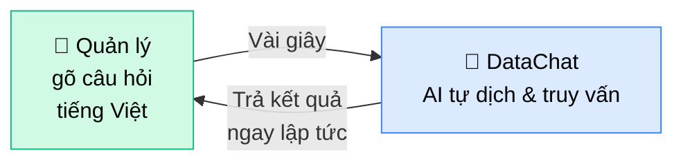
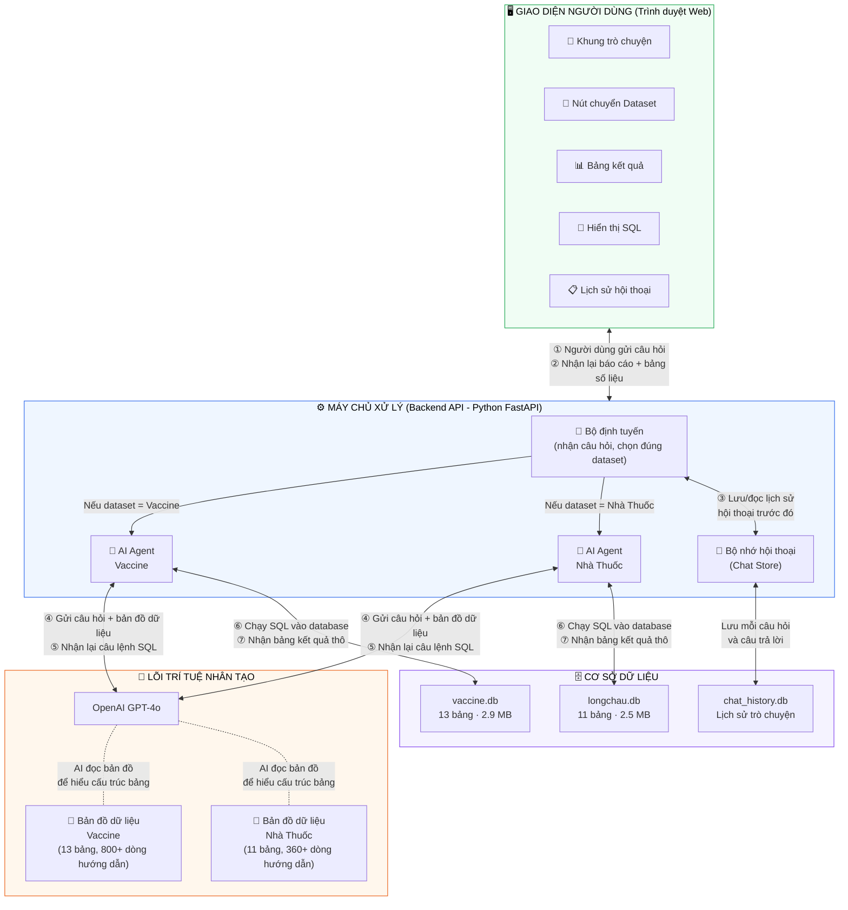
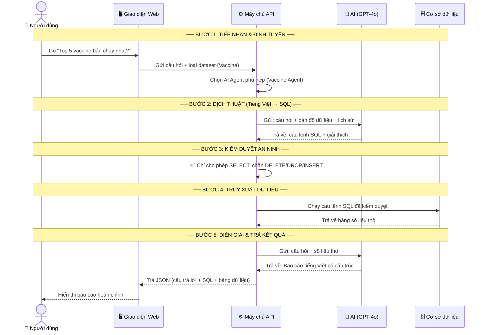
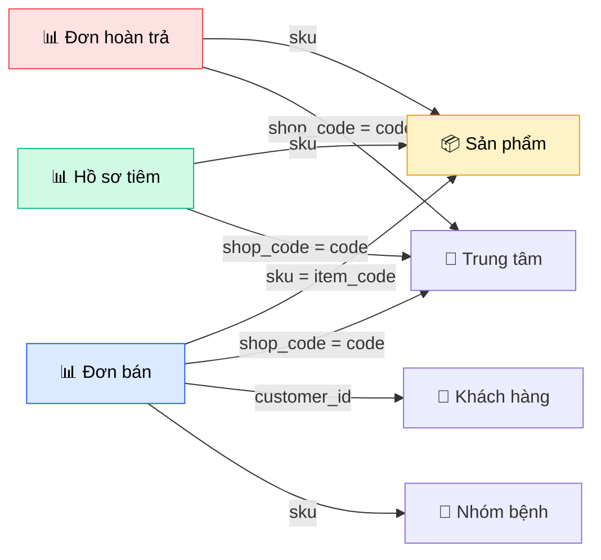
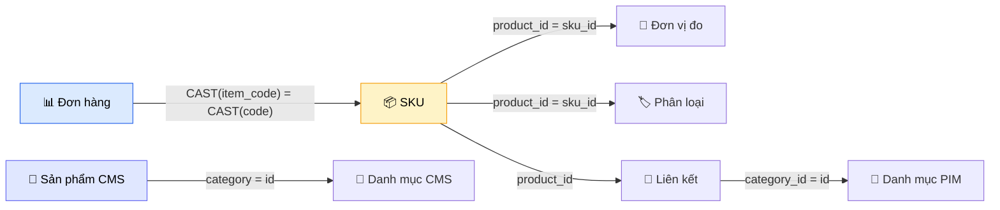
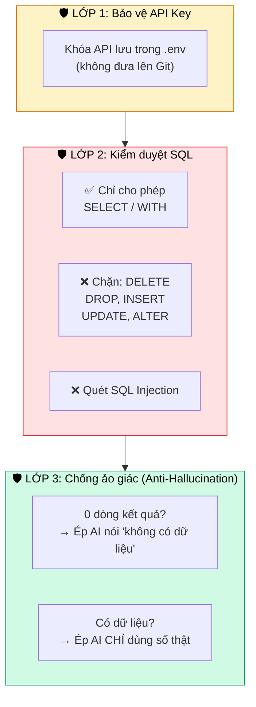

# 💬 DataChat — Trợ lý Phân tích Dữ liệu bằng AI

**SQL Agent thông minh — Hỏi đáp dữ liệu bằng tiếng Việt cho Hệ thống FPT Long Châu.**

    

---

## 1. MỤC TIÊU

Thay vì chờ đội Data/IT viết báo cáo (mất hàng giờ/ngày), người dùng chỉ cần **gõ câu hỏi bằng tiếng Việt** và nhận kết quả trong **dưới 10 giây**:



### Khả năng cốt lõi

| Khả năng | Mô tả | Ví dụ |
|----------|--------|-------|
| **Truy vấn tức thì** | Biến câu hỏi tiếng Việt thành báo cáo số liệu | *"Top 5 vaccine bán chạy nhất?"* |
| **Hiểu ngữ cảnh** | Trả lời câu hỏi nối tiếp dựa trên lịch sử | *"Giải thích cách tính kết quả trên"* |
| **Đa bộ dữ liệu** | Chuyển đổi nhanh giữa các phân hệ kinh doanh | 💉 Vaccine ↔ 💊 Nhà thuốc |
| **Chống bịa số** | Từ chối trả lời khi không có dữ liệu, thay vì đoán | Cơ chế Anti-Hallucination |

---

## 2. KIẾN TRÚC TỔNG THỂ



| Đường | Từ → Đến | Dữ liệu truyền tải |
|-------|----------|---------------------|
| **①** | Giao diện → Máy chủ | Câu hỏi tiếng Việt + loại dataset đang chọn |
| **②** | Máy chủ → Giao diện | Bài phân tích AI + câu lệnh SQL + bảng số liệu |
| **③** | Bộ định tuyến ↔ Chat Store | Đọc 20 cặp hỏi-đáp gần nhất + Lưu tin nhắn mới |
| **④** | AI Agent → GPT-4o | Câu hỏi + Bản đồ dữ liệu (~800 dòng) + Lịch sử |
| **⑤** | GPT-4o → AI Agent | Câu lệnh SQL + Giải thích ngắn |
| **⑥** | AI Agent → Database | Câu lệnh SQL (đã qua kiểm duyệt an ninh) |
| **⑦** | Database → AI Agent | Bảng kết quả thô |

---

## 3. LUỒNG XỬ LÝ (5 bước mỗi câu hỏi)



---

## 4. DỮ LIỆU

### Vaccine (13 bảng)

| Loại | Bảng | Nội dung |
|------|------|----------|
| 📊 Giao dịch | `vaccine_sales_order_detail` | Chi tiết đơn bán hàng tiêm chủng |
| 📊 Giao dịch | `vaccine_returned_order_detail` | Chi tiết đơn hoàn trả |
| 📊 Giao dịch | `vaccine_record` | Hồ sơ tiêm chủng |
| 📁 Danh mục | `dim_product` | Danh sách sản phẩm vaccine (170 loại) |
| 📁 Danh mục | `dim_shop` | Thông tin trung tâm tiêm chủng |
| 📁 Danh mục | `dim_person` | Thông tin khách hàng (đã mã hóa PII) |
| 📁 Danh mục | `dim_person_address` / `dim_family_member` | Địa chỉ & gia đình |
| 📁 Danh mục | `dim_vaccine_disease_group` | Nhóm bệnh (60 nhóm) |
| 📁 Danh mục | `dim_vaccine_regimen` | Phác đồ tiêm chủng |
| 📁 Danh mục | `dim_statellite_shop` | Shop vệ tinh (Vaccine ↔ Nhà thuốc) |

### Nhà Thuốc Long Châu (11 bảng)

| Loại | Bảng | Nội dung |
|------|------|----------|
| 📊 Giao dịch | `fact_order_detail_oms_flc` | Chi tiết đơn hàng nhà thuốc |
| 📁 Sản phẩm | `dim_product_sku_pim_flc` | SKU sản phẩm (mã, tên, ngành hàng) |
| 📁 Sản phẩm | `dim_products_cms_flc` | Chi tiết CMS (thành phần, liều dùng) |
| 📁 Sản phẩm | `dim_product_measures_pim_flc` | Đơn vị đo lường |
| 📁 Sản phẩm | `dim_product_taxonomies_pim_flc` | Phân loại bệnh/nhóm SP |
| 📁 Danh mục | `dim_categories_cms_flc` / `dim_category_pim_flc` | Danh mục sản phẩm (CMS + PIM) |

### Sơ đồ liên kết — Vaccine



### Sơ đồ liên kết — Nhà thuốc



---

## 5. BẢO MẬT 3 LỚP



---

## 6. CẤU TRÚC PROJECT

```
datachat/
├── app.py                 # FastAPI server + định tuyến API
├── sql_agent.py           # Lõi AI Agent (Text→SQL→Answer)
├── chat_store.py          # Lưu trữ lịch sử hội thoại
├── config.py              # Cấu hình (API key, DB paths, datasets)
├── train_schema.py        # 📘 Bản đồ dữ liệu Vaccine (800+ dòng)
├── train_schema_lc.py     # 📗 Bản đồ dữ liệu Nhà Thuốc (365 dòng)
├── csv_to_db.py           # Công cụ nhập CSV → SQLite
├── vaccine.db             # 🗄️ DB Vaccine (13 bảng)
├── longchau.db            # 🗄️ DB Nhà Thuốc (11 bảng)
├── chat_history.db        # 💾 Lịch sử hội thoại
├── requirements.txt       # Dependencies
├── .env                   # 🔑 API Key (KHÔNG push lên Git)
├── templates/
│   └── index.html         # 🖥️ Giao diện web (HTML+CSS+JS)
├── static/                # Logo, hình ảnh
└── csv_data/
    ├── vaccin/            # 13 tệp CSV dữ liệu Vaccine
    └── LC_data/           # 11 tệp CSV dữ liệu Nhà Thuốc
```

---

## 🚀 Hướng dẫn cài đặt

### 1. Clone repo

```bash
git clone https://github.com/quanganpham/datachat.git
cd datachat
```

### 2. Cài dependencies

```bash
pip install -r requirements.txt
```

### 3. Tạo file `.env`

```bash
cp .env.example .env
```

Mở `.env` và điền API key:

```
OPENAI_API_KEY=sk-proj-xxxxxxxxxxxxxxxxxxxxxxxx
HOST=localhost
PORT=8000
```

> ⚠️ Cần OpenAI API key. Lấy tại: https://platform.openai.com/api-keys

### 4. Import dữ liệu (nếu cần)

```bash
python csv_to_db.py
```

### 5. Chạy server

```bash
python app.py
```

Truy cập: **http://localhost:8000**

---

## 🔧 Cập nhật dữ liệu

1. Đặt file CSV vào `csv_data/vaccin/` hoặc `csv_data/LC_data/`
2. Chạy `python csv_to_db.py` để import vào database
3. Cập nhật Schema Prompt (`train_schema.py` / `train_schema_lc.py`) nếu có cột/bảng mới
4. Restart server: `python app.py`

---

## 🆘 Troubleshooting

| Lỗi | Giải pháp |
|-----|-----------|
| Conflict khi `git pull` ở file `.db` | `git checkout HEAD -- chat_history.db` rồi `git pull` |
| "Không tìm thấy OPENAI_API_KEY" | Đảm bảo file `.env` tồn tại và có key. Trên Mac, file `.` là file ẩn (`Cmd+Shift+.`) |
| "Không tìm thấy database" | Chạy `python csv_to_db.py` để tạo DB từ CSV |

---

## 📝 License

MIT
